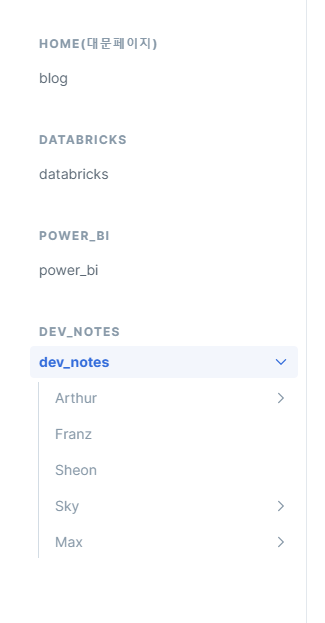
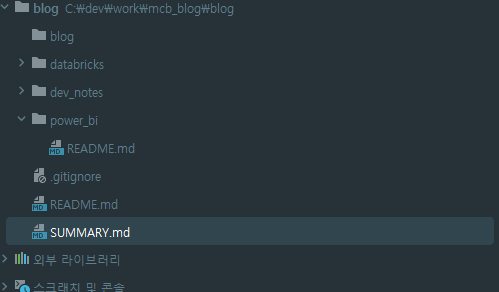
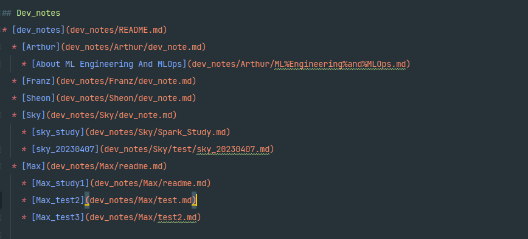

#GitBook.md

## 깃북 사용법

1. 아래 처럼 해당하는 메뉴의 카테고리화를 적용하려면, SUMMARY 파일을 수정해야합니다. 그러나 모두가 동시에 SUMMARY 파일을 수정하면 충돌의 우려가 있기때문에 브랜치 사용을 권장드립니다. 해당하는 내용을 이해하기 위해 아래와 같은 STEP을 적용해주시기 바랍니다.

2. 로컬 main 브랜치 에서 fetch를 적용합니다.
3. config/summary 브랜치로 이동합니다.
4. 아래와 같은 SUMMARY.md 파일을 수정 및 추가하여 카테고리를 적용합니다.
   
   - 4-1 summary 파일은 다음과 같은 내용으로 적용 후 main 브랜치 에 Pull Request 적용시 블로그에서 카테고리화가 적용됩니다. (들여쓰기 적용 필요)
   - 

5. config/summary 브랜치 에서 main 브랜치로 PR (Pull Reuqest) 요청을 하고 Merge 를 반영합니다.
