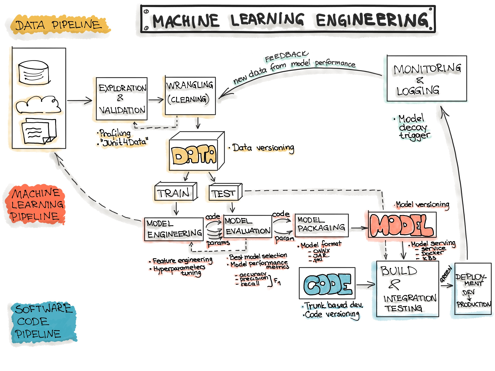

### Machine Learning Engineering
머신러닝은, 정말 극단적으로 축약해서 포현하자면 "학습하고, 예측하는" 것입니다. 하지만 실제 머신러닝을 어딘가에 적용하기 위해서는, 다음과 같은 문제들이 나타납니다.

a. 데이터는 어디서, 어떻게 오는가?

b. 예측은 잘 수행되고 있는가?

c. 예측 Output은 어디로, 어떻게 가는가?

간단하게 표현하자면 a는 데이터, b는 모델, c는 서비스(혹은 코드)에 대한 문제입니다. kaggle에 제출하거나, 아니면 단순 취미로써 머신러닝을 돌리는 게 아니라면 위 문제들에 대해서는 반드시 생각하여야 합니다. 실제로 대부분의 서비스에서 머신러닝 코드가 차지하는 비중은 5~10%도 되지 않으며, a, b, c에 대한 코드가 대부분을 차지합니다. 하나씩 살펴보겠습니다.

a. 데이터는 어디서, 어떻게 오는가?

서비스 환경에서 머신러닝 모델은 한번 학습하고 한번 예측하는 것이 아닌, 배치 프로세스가 돌 때마다 학습과 예측 활동을 반복해야 합니다. 그러려면 데이터가 지속적으로 공급이 되어야하고, 데이터가 공급되기 위해서는 일종의 파이프라인이 구축되야 한다는 것을 의미합니다. 이 파이프라인은 데이터에 관한 일련의 ETL 과정을 진행하여 모델로 데이터를 (학습과 예측 양면으로) 공급합니다,

b. 예측은 잘 수행되고 있는가?
 
 아무리 정교한 모델이라 하더라도 시간이 지나면 데이터셋이 변화됨에 따라 모델의 성능이 떨어집니다. 따라서 예측을 잘 수행하고자 한다면 주기적으로 데이터셋의 특성을 다시 파악하고, 모델을 재학습시키고, 성능을 평가하는 과정을 거쳐야 합니다. 상황에 따라서는 과거 모델을 쓸 수도 있으니 각 모델에 대한 버전 관리를 고려해야 할 수도 있습니다.
 
c. 예측 Output은 어디로, 어떻게 가는가?

 예측 결과는 떼어놓고만 보면 어떤 Integer, 아니면 Float, 아니며 String의 집합 자료형일 뿐입니다. 이 예측 결과를 가지고 어떤 서비스를 제공하고자 한다면 이 예측 결과를 어떤 소프트웨어 안에서 활용해야 합니다. 즉 예측 결과를 가공하여 전송하는 파이프라인 또한 구축이 되어야 합니다.
 
 이상의 과정을 **머신러닝 엔지니어링(Machine Learning Engineering)** 이라고 표현합니다. 다르게 말하자면 머신러닝 엔지니어링은 단순히 머신러닝을 돌리는 것이 아닌, 머신러닝은 물론이고 데이터, 서비스 측면을 포함한 일련의 시스템을 구축하는 분야라고 할 수 있겠습니다. 머신러닝 프로젝트를 진행할 때에는 반드시 위 3가지 측면에 대해서 생각하고 있어야 합니다!

 

### MLOps란?
 개발자라면 아마 DevOps라는 개념, 혹은 직군에 대한 이야기를 들어보신 적이 있을 겁니다. DevOps란, 일반적인 정의에 의하면, "개발과 운영의 통합"이라고 볼 수 있을 것 같습니다.
 여기서 개발이란 "시스템을 만드는 사람들", 즉 우리같은 사람들을 뜻하며, 운영이랑 "시스템을 유지하는 사람들"을 뜻합니다. (게임 개발자와 GM을 생각하시면 직관적으로 이해할 수 있습니다.) 이 두 부서는 오랜 기간 동안 분리되어 있었으며, 따라서 운영 중 생기는 장애, 혹은 개선사항에 대해서는 많은 문서와, 많은 시간이 투입되어야 실제 서비스에 반영이 되었습니다. 그러나 JIRA, Jenkins 등의 Devops 툴의 등장으로 개발과 운영을 한 사이클 내에서 관리할 수 있게 되었습니다. 
 
 DevOps의 장점은 매우 명확합니다. 개발과 운영 사이에 간극이 좁아짐에 따라 서비스의 오류 및 수정 사항이 빠르게 반영되며, 이상의 과정이 (DevOps를 설명하는 그림에서 흔히 볼 수 있듯) 하나의 순환주기를 이루게 됨으로써, 서비스는 지속적으로 개선될 수 있습니다. 듣기에 따라서는 당연한 이야기일지 모르겠으나, DevOps는 기존의 Waterfall 개발만 해왔던 조직에 비해 굉장한 이점을 제공합니다!
 

머신러닝 서비스를 제공하는 기업에게도 DevOps를 적용할 수 있습니다. 다만 일반적인 DevOps환경보다는 신경써야 할 것이 더 많습니다. 

**Testing**
일반적인 단위, 통합 테스트 외에 데이터 검증, 학습된 모델 품질 평가, 모델 검증 등의 과정

**Deployment**
오프라인에서 학습된 ML모델을 배포하는 수준에 그치는 것이 아니라, 새 모델을 재학습하고, 검증하는 과정

**Production**
일반적으로 알고리즘과 로직의 최적화를 통해 최적의 성능을 낼 수 있는 소프트웨어 시스템과 달리, ML 모델은 이에 더해서 지속적으로 진화하는 data profile 자체만으로도 성능이 저하될 수 있습니다.
즉, 기존 소프트웨어 시스템보다 더 다양한 이유로 성능이 손상될 수 있으므로, 데이터의 Summary Statistics를 꾸준히 추적하고, 모델의 온라인 성능을 모니터링하여 값이 기대치를 벗어나면 알림을 전송하거나 롤백을 할 수 있어야 합니다.

**CI (Continuous Integration)**
Code와 Components뿐만 아니라 Data, Data Schema, Model에 대해 모두 테스트되고 검증.

**CD (Continuous Delivery)**
단일 소프트웨어 패키지가 아니라 ML 학습 파이프라인 전체를 배포.

**CT (Continuous Training)**
ML 시스템만의 속성으로, 모델을 자동으로 학습시키고 평가하는 단계.

이상의 요소들을 자동화시킴으로써 잘 구축된 MLOps 환경은 엔지니어가 로그 대시보드, 슬랙 메신저만 확인해도 될만큼 뛰어난 안정성과 편의성을 보입니다. 비록 우리는 지속적인 서비스에 대한 고민을 할 필요는 없지만, 위 개념들을 생각해가며 개발한다면 아키텍처 측면에서 더 뛰어난 프로젝트를 할 수 있을겁니다.

